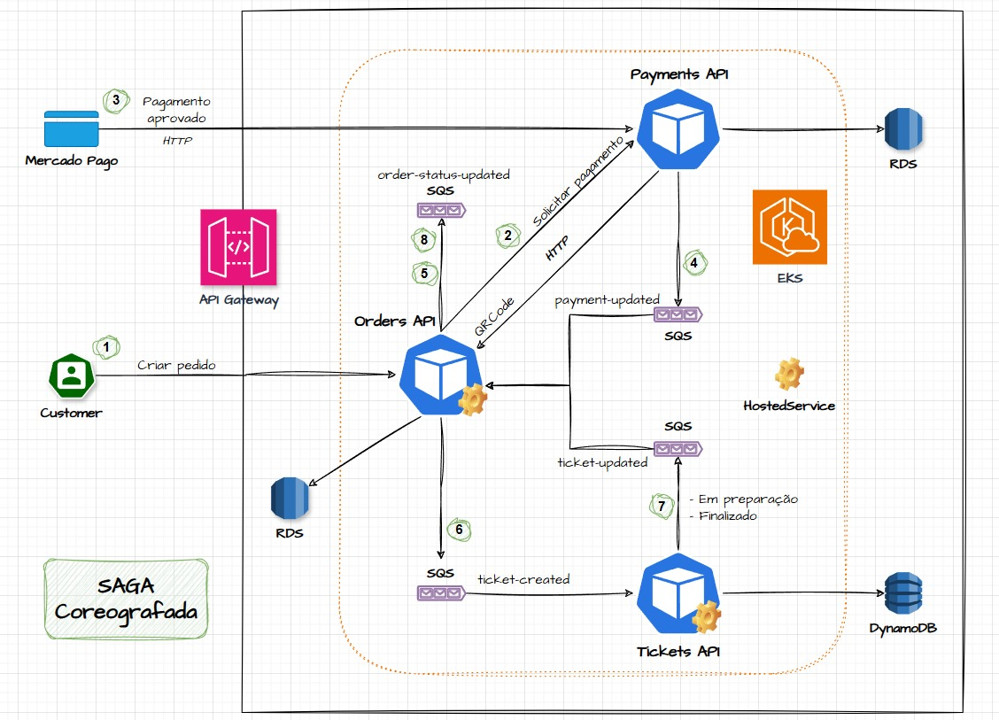
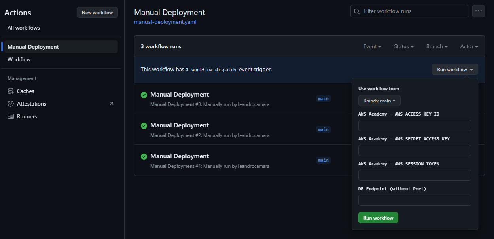
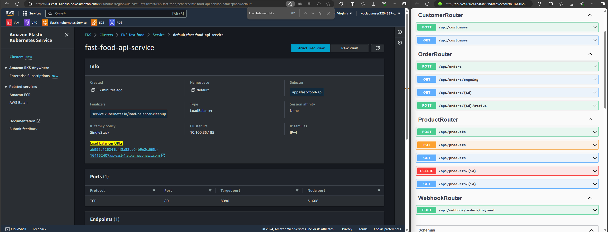

# fiap.tech-challenge.fast-food.api.tickets

## Introdução
Projeto desenvolvido para a Pós-Graduação FIAP - Software Architecture.
O Tech Challenge Grupo 19 é composto por:
- Danilo Queiroz da Silva
- Elton Douglas Souza
- Leandro da Silva Câmara
- Marcelo Patricio da Silva


## Tecnologias
* [ .NET 8.0 ](https://dotnet.microsoft.com/pt-br/download/dotnet/8.0)
* [ Entity Framework Core 8.0 ](https://devblogs.microsoft.com/dotnet/announcing-ef8/)
* [ OpenAPI - Swashbuckle ](https://learn.microsoft.com/pt-br/aspnet/core/tutorials/getting-started-with-swashbuckle)
* [ FluentMigrator ](https://fluentmigrator.github.io/)
* [ Postgresql ](https://www.postgresql.org/)
* [ Amazon SQS ](https://aws.amazon.com/pt/sqs/)


## Arquitetura
**Tickets API** faz parte de uma solução composta por outras aplicações: [_Orders API_](https://github.com/leandrocamara/fiap.tech-challenge.fast-food.api.orders) e [_Payments API_](https://github.com/leandrocamara/fiap.tech-challenge.fast-food.api.payments).

Estas três aplicações são executadas no _AWS EKS_ e se comunicam via _HTTP_ e por mensagens via _Amazon SQS_.

### SAGA Coreografada

Neste projeto, foi adotado o padrão **SAGA Coreografada** para gerenciar as transações distribuídas entre os microsserviços.
Optamos pela SAGA Coreografada ao invés da versão orquestrada, principalmente por três razões:

1. **Simplicidade de Implementação:** A SAGA Coreografada se alinha melhor à nossa necessidade de uma arquitetura mais simples e direta. Não há a necessidade de um serviço centralizado para orquestrar as transações, o que reduz a complexidade de infraestrutura.

2. **Menor Quantidade de Serviços:** Como não temos um orquestrador dedicado, conseguimos minimizar a quantidade de serviços no ecossistema, o que facilita a manutenção e monitoramento do sistema.

3. **Desacoplamento entre Microsserviços:** Cada microsserviço é responsável por suas próprias ações e escuta os eventos nas filas do _Amazon SQS_ (`payment-updated`, `ticket-created`, `ticket-updated` e `order-status-updated`). Essa abordagem permite que cada serviço responda autonomamente aos eventos, garantindo maior flexibilidade e escalabilidade.

Embora a SAGA Orquestrada ofereça mais controle centralizado, nossa decisão foi baseada na busca por uma solução mais simples, com menos pontos de falha e maior autonomia entre os microsserviços.



A aplicação baseia-se na _Clean Architecture_. Para a camada _Entities_, foi adotado o _Domain Driven Design_.
Segue a estrutura da aplicação:

    .
    ├── Drivers                     # Frameworks & Drivers
        ├── API                     # Web API (.NET 8)
            ├── HealthChecks
            └── Routers
        └── External                # External Interfaces & DB
            ├── Clients
            └── Persistence
                ├── Migrations
                └── Repositories
    ├── Adapters                    # Interface Adapters
        ├── Controllers
        └── Gateways
    └── Core                        # Business Rules
        ├── Application
            └── UseCases
        └── Entities (Domain)
            ├── BoundedContext
                └── Model           # Aggregates - entities and value objects
            └── SeedWork            # Reusable classes/interfaces for the domain (by Martin Fowler)


## Execução

### AWS (Academy)

Após a execução dos [_Workflows_](https://github.com/leandrocamara/fiap.tech-challenge.fast-food.api.tickets/actions) (GitHub Actions), a aplicação é implantada no **_Amazon EKS_** (_Elastic Kubernetes Service_) e se conecta ao **_Amazon RDS_** (_Relational Database Service_).

Pré-requisitos:
1. Executar o [_Workflow_](https://github.com/leandrocamara/fiap.tech-challenge.fast-food.infra.k8s) do repositório do **_EKS_**;
2. Executar o [_Workflow_](https://github.com/leandrocamara/fiap.tech-challenge.fast-food.infra.database) do repositório do **_RDS_**.

Há duas maneiras de executar e implantar a aplicação na _AWS_:

1. Realizando um `push` na `main`, por meio de um `Merge Pull Request`;

2. Executando o [_Manual Deployment_](https://github.com/leandrocamara/fiap.tech-challenge.fast-food.api.tickets/actions/workflows/manual-deployment.yaml) (_Workflow_)

   

   2.1. Por padrão, o _Workflow_ utilizará as `Secrets` configuradas no projeto. Caso esteja utilizando o `AWS Academy`, recomenda-se informar as credencias da conta. **Obs.:** Cada sessão do _AWS Academy_ dura **4 horas**.

Para acessar o _Swagger_ da aplicação, é possível obter a URL no **Console da AWS**. Acesse: _`EKS > Clusters > EKS-fast-food > Service > Load balancer URLs`_

**Obs.:** Utilize o `http://<load-balancer-url>/swagger` (**ao invés de** `https`).




### CLI

No arquivo `launchSettings.json`, preencher as seguintes variáveis, com as credenciais do AWS (Academy):
```json
{
  "AmazonSettings__AccessKey": "",
  "AmazonSettings__SecretKey": "",
  "AmazonSettings__SessionToken": ""
}
```

Inicie a Aplicação (API):
```shell
dotnet run --project .\src\Drivers\API\API.csproj
```

Swagger UI da API: `http://localhost:5000/swagger` (***Recomendado para testar as chamadas aos endpoints***)


## Como testar

Para o correto funcionamento deste serviço, os demais serviços também precisam estar em execução ([_Orders API_](https://github.com/leandrocamara/fiap.tech-challenge.fast-food.api.orders) e [_Payments API_](https://github.com/leandrocamara/fiap.tech-challenge.fast-food.api.payments)).


### Fluxo de teste

Para testar a aplicação, recomendamos a seguinte ordem:
1. _Orders API_ - Incluir um produto.
2. _Orders API_ - Incluir um novo cliente.
3. _Orders API_ - Buscar a lista de produtos por categoria.
4. _Orders API_ - Criar um novo pedido (podendo ou não informar o ID do cliente).
5. _Payments API_ - Atualizar o status do pagamento.
6. _Tickets API_ - Atualizar o status da comanda ("Em preparação" e "Pronta").
7. _Orders API_ - Listar todos os pedidos em andamento.
8. _Orders API_ - Atualizar o status do pedido para "Finalizado".

Todo o fluxo está presente na [**_Collection do Postman_**](./docs/postman/FIAP.FastFood.postman_collection.json).


### Schema de Banco de dados
A aplicação conta com uma biblioteca de _migrations_ configurada, portanto, ao iniciar a aplicação, o banco de dados será atualizado com as tabelas e dados necessários.


### Endpoints
O detalhe de cada _request_, como seus parâmetros e tipos estão detalhadas nas interfaces de UI do _Swagger_. Nas próximas sessões estão resumidas as operações existentes.


### Comandas
É possível criar uma comanda para a cozinha e atualizar seu status.
- `[POST] api/tickets`: Criar uma comanda.
- `[PUT] api/tickets/{id}/status`: Atualiza o status de uma comanda.

#### Status das Comandas
- `1`: Recebida
- `2`: Em preparação
- `3`: Pronta


### Vídeos de apresentação
Alguns vídeos que explicam como implantar a aplicação, uso das APIS e escolhas de design estão em uma [playlist do youtube](https://youtube.com/playlist?list=PLuVYnmmdbgO1ams1lmM4tDwmZxym5vV7w&si=ve6Ck3-chgUc_JFZ).
